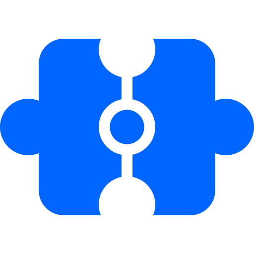
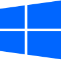
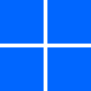

  

<h1 align="center">Deskwarp</h1>

  <strong>Bring the legendary Wobbly Windows effect to your desktop.</strong>

  
  &nbsp;
  
   
  <strong>Supported OS:</strong> Windows 10 & 11

  
  &nbsp;&nbsp;
  

---

## About The Project

Deskwarp is a highly optimized, open-source desktop customization utility designed specifically for Windows 10 and Windows 11 environments. It reintroduces the classic, fluid, physics-based "Wobbly Windows" animation to modern operating systems. 

Built with performance in mind, Deskwarp calculates and renders real-time window deformations. Whether you are moving or resizing application windows, the software applies smooth, interactive physics calculations that react instantly to cursor input, significantly enhancing the visual feedback and overall user experience of your workspace.

## Why Choose Deskwarp

| Advantage | Description |
| :--- | :--- |
| **Fully Open-Source** | 100% transparent codebase. The project is entirely open for auditing, contributing, and modification with zero hidden background processes or telemetry. |
| **Native Performance** | Engineered in C++ for maximum efficiency. Deskwarp operates with a minimal memory and CPU footprint, ensuring that system resources remain dedicated to your primary tasks. |
| **Seamless Integration** | Fully compatible with modern Windows architectures. It functions unobtrusively alongside default OS window management protocols. |
| **Physics-Based Rendering** | Employs advanced kinetic algorithms to ensure high frame rates and completely stutter-free animations, even during complex window operations. |

## Open Source & Transparency

Security and community trust are fundamental to this project. Deskwarp is distributed completely free of charge, providing unrestricted access to the underlying logic and rendering pipeline. Developers and enthusiasts are encouraged to inspect the repository, review the architecture, compile the software directly from the source, and contribute to future iterations.

  

  <small>
    <b>Keywords (do not read):</b> wobbly windows, jelly windows, windows 10, windows 11, desktop customization, desktop ricing, window physics, desktop effects, fluid window animations, bouncy windows, kinetic ui, window manager, compiz fusion alternative, compiz for windows, kwin wobbly windows, windowfx alternative, c++ window manager, qt6 desktop application, win32 api tweaks, directx rendering, dwm hooking, desktop modding, aesthetic desktop, open-source windows tweaks, ui tweaking, visual enhancement, native performance, window drag effects.
  </small>

